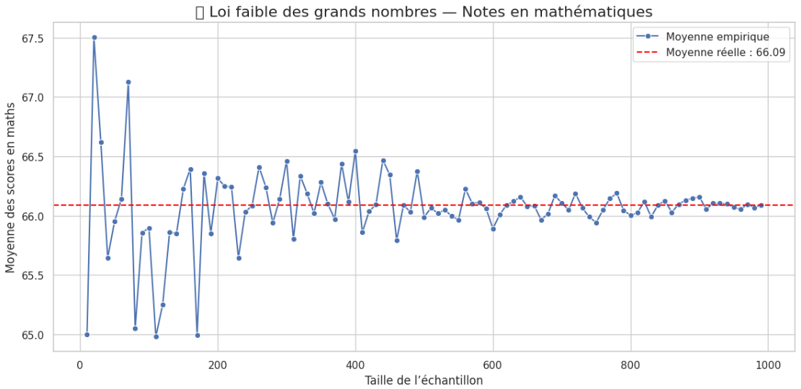

# LFGN  
Code Python pour un projet mettant en application la loi Faible des Grands Nombres (LFGN - PROBA / STATISTIQUE)

## Loi Faible des Grands Nombres (LFGN)

Ce projet Python illustre la **Loi faible des grands nombres** à travers un exemple concret avec des notes d’étudiants en mathématiques.

## Description

La loi faible des grands nombres dit que plus la taille d’un échantillon augmente, plus la moyenne de cet échantillon se rapproche de la moyenne réelle (espérance) de la population.

Ici, nous utilisons un dataset réel contenant les notes en mathématiques de plusieurs étudiants. Le programme tire des échantillons aléatoires de tailles croissantes et calcule leurs moyennes, pour montrer que ces moyennes tendent vers la moyenne globale.

## 📊 Illustration du résultat

Voici une visualisation du résultat obtenu avec un graphique matplotlib :



---

## Utilisation

### Via un IDE (exemple : Visual Studio Code)

1. Télécharger le dataset `StudentsPerformance.csv` et le placer dans le dossier du projet.

   [Lien du dataset](https://www.kaggle.com/datasets/spscientist/students-performance-in-exams)  
   Colonne utilisée : `math score`

2. Installer les dépendances :

```bash
pip install pandas numpy matplotlib seaborn
```
3. Lancer le script Python :

```bash
python code.py
```
### Via Google Colab
1.Importer le dataset StudentsPerformance.csv depuis votre ordinateur dans Colab.

2.Pas besoin d’installer des dépendances, elles sont déjà présentes.

3.Copier le code dans une cellule et l’exécuter. Vous obtiendrez le même résultat montré plus haut.
